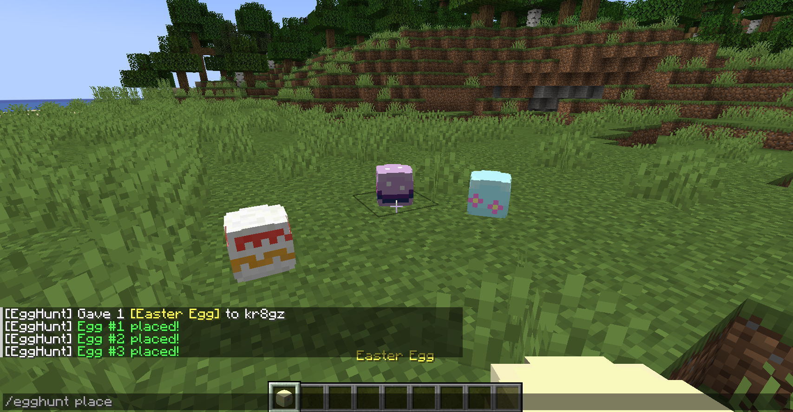
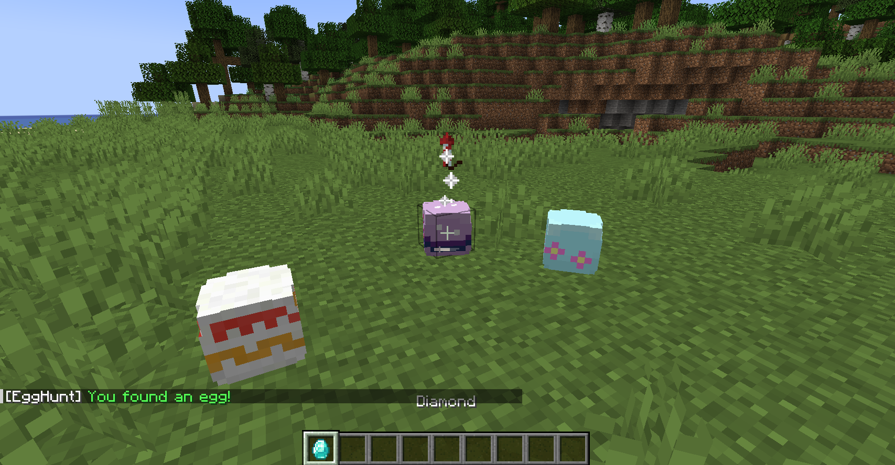
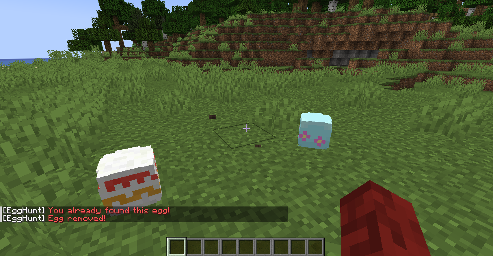
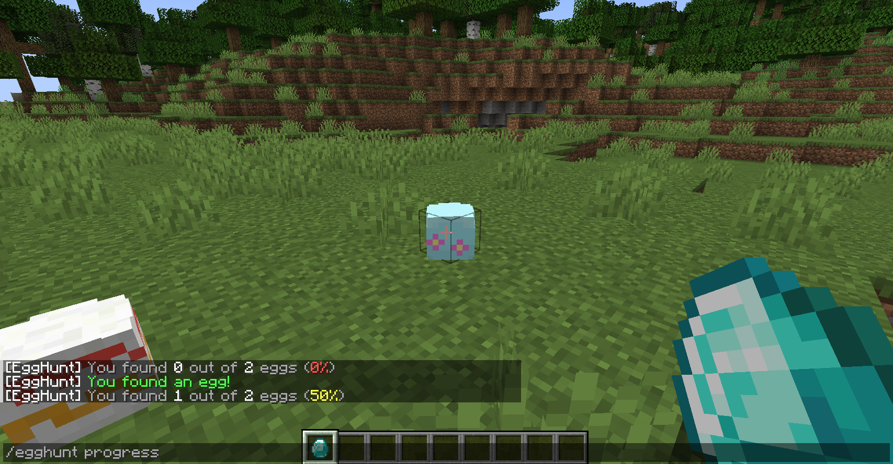
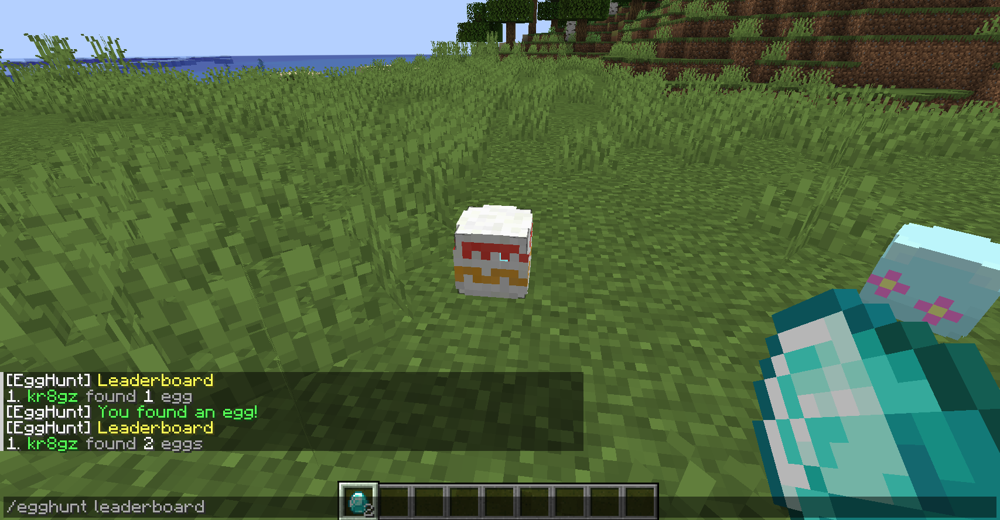

# Egg Hunt
A simple server-side easter egg hunt mod for Fabric.

## Installation
Download this mod along with its dependencies and put them in your server's mods folder.
It should be as simple as that :)

## Features
The features of this mod were designed to be as easy to use as possible.

### Placing eggs
Placing eggs in-game requires the [`egghunt.place`](#permissions) permission.
Use the `/egghunt place` command to obtain an Easter Egg item and start placing!

Every time an egg is placed, the item will switch to a randomly chosen texture
from the `[eggPlacement]` section of the configuration.

### Finding eggs
Eggs can be found by any player when they left-click or right-click on one.
The `[onEggFound]` section of the configuration allows you to customize actions that are
run whenever a player finds a new egg, such as rewarding the player with a specific item.
By default, a firework is spawned.

Additionally, you can customize actions that are run when a player has found *all* eggs
in the `[onFoundAll]` section of the configuration.

### Removing eggs
To remove eggs by breaking them, the [`egghunt.remove`](#permissions) permission is required.
However, the mod **cannot** track eggs that are broken by other means, such as using water or
TNT. (Note: this may be changed in the future.) For now, it is recommended to set the gamemode
of players who are finding eggs to adventure mode, or to install a separate world protection mod.

### Progress and leaderboard
Every player can track their egg finding progress with the `/egghunt progress` command:

The `/egghunt leaderboard` command will display the current rankings of players participating
in the egg hunt:

### Resetting eggs
There are two commands to reset egg data, both of which require the
[`egghunt.reset`](#permissions) permission:

* `/egghunt reset player <selector>` – Additionally requires the
  [`egghunt.reset.player`](#permissions) permission. This command resets the selected players' 
  progress, allowing them to collect all previously found eggs again.

* `/egghunt reset eggs` – Additionally requires the [`egghunt.reset.eggs`](#permissions)
  permission. This command removes all egg locations from the database, though the physical
  eggs will still persist.

### Localization
This mod provides server-side translations for all its messages. If you can, please consider
contributing translations in your preferred language!

## Configuration
When you launch your server, a configuration file will be generated at `config/EggHunt.toml`.
The generated file contains comments with additional information on individual settings.

## Permissions
Permissions can be customized using a mod like [LuckPerms](https://luckperms.net). If no
permissions are set, players will instead need the minimum permission level defined by the
`defaultPermissionLevel` setting in the configuration.
